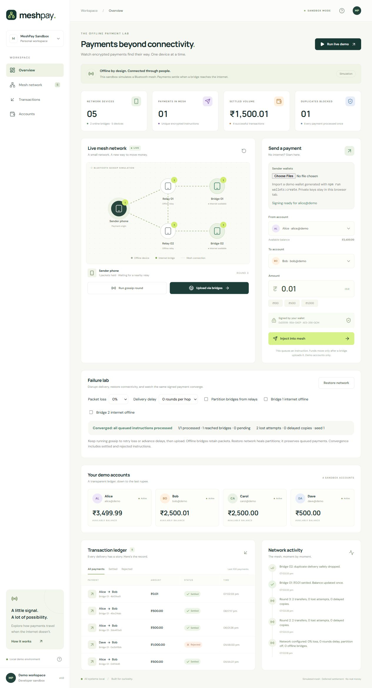
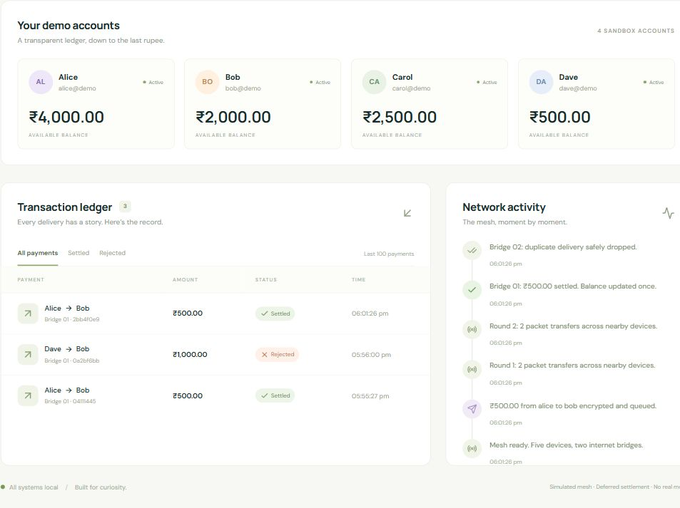
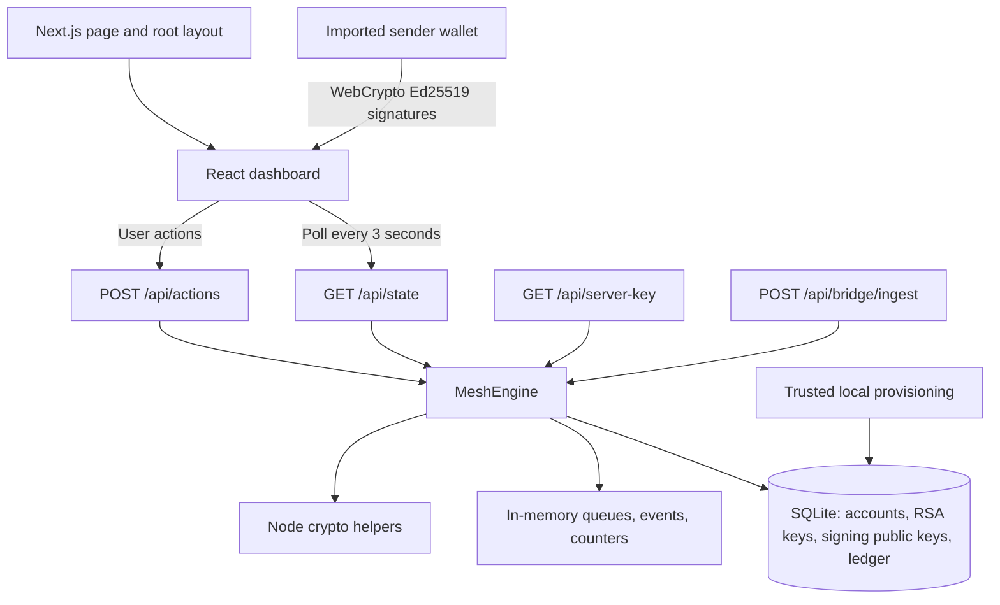
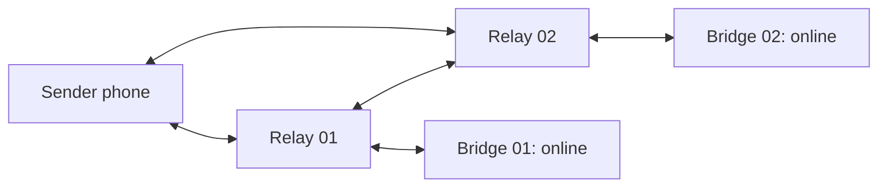

# MeshPay

**A signed, encrypted payment mesh simulator built with Next.js, TypeScript, and SQLite.**

MeshPay demonstrates how encrypted payment instructions can travel through offline relays, reach internet-connected bridges, and settle once in a persistent ledger—even when multiple bridges deliver copies of the same payment.

The dashboard lets you compose payments, advance the mesh one hop at a time, upload packets, and inspect balances, transactions, and network activity.

> This is a local sandbox with demo balances. Bluetooth and device connectivity are simulated inside one server process. No real money moves, and there is no bank or UPI integration. Ed25519 verifies possession of registered sender keys; real-world identity enrollment is outside the demo.

## Contents

- [Features](#features)
- [Screenshots](#screenshots)
- [Technology stack](#technology-stack)
- [Getting started](#getting-started)
- [Using the simulator](#using-the-simulator)
- [Architecture](#architecture)
- [Mesh topology and routing](#mesh-topology-and-routing)
- [Payment lifecycle](#payment-lifecycle)
- [Encryption and packet format](#encryption-and-packet-format)
- [Sender wallets and signatures](#sender-wallets-and-signatures)
- [Failure simulation and convergence](#failure-simulation-and-convergence)
- [Settlement and duplicate protection](#settlement-and-duplicate-protection)
- [Data model and persistence](#data-model-and-persistence)
- [API reference](#api-reference)
- [Dashboard behavior](#dashboard-behavior)
- [Repository structure](#repository-structure)
- [Development and testing](#development-and-testing)
- [Security and scope](#security-and-scope)
- [Threat model](#threat-model)
- [Deployment considerations](#deployment-considerations)
- [Troubleshooting](#troubleshooting)
- [Possible next steps](#possible-next-steps)

## Features

- Four demo accounts with balances represented as integer paise.
- Payment composition with account and amount validation.
- Hybrid RSA-OAEP-SHA256 and AES-256-GCM encryption.
- Per-user Ed25519 signatures checked against registered public keys before queueing and settlement.
- Signed packet identity and a hash-chain proof for decrementable TTL.
- Seeded packet loss, bridge outages, partitions, delayed delivery, and convergence metrics.
- Five simulated devices on a fixed, bidirectional mesh.
- Manual gossip rounds with packet deduplication and hop limits.
- Two online bridges delivering packets to settlement.
- Transactional SQLite balance updates and ledger inserts.
- Persistent duplicate protection using ciphertext hashes and sender nonces.
- Settled, rejected, duplicate, and invalid delivery outcomes.
- Responsive dashboard with device inspection, ledger filters, and activity.
- One-click demo and mesh reset that preserves financial state.
- Automated encryption, routing, settlement, validation, and persistence tests.

## Screenshots

The current dashboard includes sender wallet import and the Failure lab. The ledger reference below shows the original layout.

### Dashboard



### Ledger



## Technology stack

Versions below reflect `package.json` declarations; `package-lock.json` records resolved versions.

| Layer        | Technology                     | Role                                      |
| ------------ | ------------------------------ | ----------------------------------------- |
| Framework    | Next.js 16.4.0, App Router     | Pages and HTTP route handlers             |
| Interface    | React 19.3.0                   | Client dashboard and interaction state    |
| Language     | TypeScript ^5.9.3              | Shared contracts and strict type checking |
| Runtime      | Node.js >=22.13.0              | Server, cryptography, built-in SQLite     |
| Database     | `node:sqlite` / `DatabaseSync` | Accounts, keys, ledger                    |
| Cryptography | `node:crypto`                  | Key generation, encryption, hashing       |
| Validation   | Zod ^4.3.6                     | Request and instruction validation        |
| Icons        | Lucide React ^0.577.0          | Dashboard iconography                     |
| Styling      | CSS                            | Responsive layout and mesh visualization  |
| Testing      | Node test runner via `tsx`     | TypeScript engine and route tests         |
| Formatting   | Prettier                       | Source formatting                         |

No external database service, ORM, or payment provider is required.

## Getting started

### Requirements

- Node.js **22.13.0 or newer**; Node 24 is recommended.
- npm.
- A writable project directory for the database.

### Install and run

```sh
git clone https://github.com/naman777/meshpay.git
cd meshpay
npm ci
npm run wallets:create
npm run dev
```

Open [http://localhost:3000](http://localhost:3000).

No environment variables or external credentials are required. Provisioning registers Ed25519 public keys and writes demo wallets under `.data/wallets/`. Import the relevant JSON wallet in **Sender wallets** before sending; import `alice-demo.json` for the one-click demo. Signing requires WebCrypto Ed25519 on localhost or HTTPS. The engine creates `.data/meshpay.sqlite` when first used.

### Production build locally

```sh
npm run build
npm start
```

A production build serves the same signed-payment simulator; it does not add real-world identity enrollment, authenticated transport sessions, or bank settlement.

## Using the simulator

### Manual flow

1. Import the wallet for your sender and select a different receiver. You can import multiple wallets for the local demo.
2. Enter a positive rupee amount with at most two decimal places.
3. Click **Inject into mesh**. The browser signs the instruction and packet commitment. The server verifies, encrypts, and queues it; balances remain unchanged.
4. Click **Run gossip round** once. Both relays receive the packet.
5. Run a second round. Both internet bridges receive copies.
6. Click **Upload via bridges**. The first valid delivery settles; the second is dropped as a duplicate.
7. Inspect balances, the ledger entry, and activity. Select devices to inspect their queue sizes.

With a fresh database, ₹500 Alice → Bob changes Alice from ₹5,000 to ₹4,500 and Bob from ₹1,000 to ₹1,500. The ledger contains one settled entry.

### One-click demo

**Run live demo** performs:

```text
Reset mesh → Queue ₹500 Alice → Bob → Gossip → Gossip → Upload
```

The demo requires Alice's imported wallet. Each run creates a new signed payment and nonce. It transfers another ₹500 while Alice has sufficient funds; later runs can produce insufficient-funds rejections. Authorization is verified before reset so invalid demo requests cannot discard queues. There are no prepopulated fake ledger transactions.

### Reset

**Reset mesh** clears queues, delayed deliveries, activity, session counters, and convergence tracking. It restores default failure settings. It preserves accounts, balances, encryption keys, registered signing public keys, ledger entries, and replay protection.

There is no dashboard control to reset balances or top up accounts. Seed accounts are inserted only if missing; existing balances survive restart. A fresh database is needed to restore the original seed state.

## Architecture

MeshPay consists of a browser dashboard, Next.js route handlers, an in-process mesh engine, cryptography helpers, and local SQLite storage.



### Browser and page layer

`src/app/page.tsx` renders `web/components/dashboard.tsx`, a client component. The root layout supplies metadata and global CSS. The browser imports a sender wallet, generates nonces and hop proofs, signs canonical authorization data, and sends signed actions. It does not own the ledger or perform packet encryption. Imported signing keys remain in browser tab memory and never enter an HTTP request.

### HTTP layer

Handlers under `src/app/api` validate requests and delegate to the engine. All API routes use the Node.js runtime. State and public-key routes are dynamic; state responses also set `Cache-Control: no-store`.

The dashboard uses `/api/actions` and `/api/state`. Public-key and ingestion endpoints provide programmatic access. The built-in bridge upload action calls the engine directly rather than making HTTP requests to `/api/bridge/ingest`.

### Engine layer

`web/server/engine.ts` owns topology, queues, routing, payment validation, logging, database initialization, and settlement.

`getEngine()` lazily creates a `MeshEngine` and caches it on `globalThis` for reuse within a server process. Requests in that process share the mesh. This is an in-process singleton, not distributed shared state.

### Cryptography and contracts

`web/server/crypto.ts` implements RSA/Ed25519 key generation, signature verification, AES encryption/decryption, hash-chain proofs, and ciphertext hashing. `web/lib/protocol.ts` defines strict schemas and canonical signing data; `web/lib/wallet.ts` handles browser wallet import/signing. `web/lib/types.ts` defines the shared contracts.

### Storage

SQLite operations are synchronous. Accounts, keys, and ledger entries persist on disk; transport queues and session activity stay in memory.

## Mesh topology and routing



| Device ID  | Display name | Connectivity | Purpose                             |
| ---------- | ------------ | ------------ | ----------------------------------- |
| `alice`    | Sender phone | Offline      | Initial queue for composed payments |
| `relay-1`  | Relay 01     | Offline      | Relay toward Bridge 01              |
| `relay-2`  | Relay 02     | Offline      | Relay toward Bridge 02              |
| `bridge-1` | Bridge 01    | Online       | Delivery to settlement              |
| `bridge-2` | Bridge 02    | Online       | Delivery to settlement              |

The sender device ID remains `alice` regardless of the account selected in the form. Devices model transport roles; accounts identify whose funds move.

### Gossip rules

- Each round snapshots all device queues before copying packets.
- Packets present at the start can move one edge in either direction.
- Newly received packets can be forwarded only in the next round.
- Receivers skip packet IDs they already hold.
- New packets start with `ttl: 5`; forwarded copies decrement TTL by one and hash the hop proof once.
- TTL-zero copies remain stored but cannot be forwarded further.
- Source devices retain copies, allowing retries after loss; there is no automatic eviction.
- Routing advances manually, with no Bluetooth discovery or background transport.

Two rounds reach both bridges in this topology. Each round increments `rounds`; successful copies increment `transfers`.

Upload processes all packets held by online devices and retains them afterward. Repeated uploads therefore create further duplicate deliveries. TTL limits forwarding; settlement does not reject a packet solely because TTL is zero.

## Payment lifecycle

```mermaid
sequenceDiagram
    actor User
    participant UI as Dashboard
    participant API as Actions API
    participant Engine as MeshEngine
    participant DB as SQLite
    User->>UI: Send ₹500 Alice to Bob
    UI->>UI: Sign instruction and packet commitment
    UI->>API: POST signed authorization and initial hop proof
    API->>Engine: send(signed authorization, hop proof)
    Engine->>Engine: Verify registered key, validate, encrypt, queue
    API-->>UI: Updated state; balances unchanged
    User->>UI: Run two gossip rounds
    UI->>API: POST gossip twice
    API->>Engine: Copy through relays to bridges
    User->>UI: Upload via bridges
    UI->>API: POST flush
    API->>Engine: flush()
    Engine->>Engine: Decrypt, verify signature, check packet ID and TTL proof
    Engine->>DB: Begin transaction; check duplicates
    Engine->>DB: Update balances and insert ledger row
    Engine->>DB: Commit
    Engine->>DB: Find existing entry for second delivery
    Engine->>Engine: Log dropped duplicate
    API-->>UI: Updated balances, ledger, activity
```

Queueing does not reserve funds. Balance is checked at settlement time. Two instructions may both enter the mesh, while only the first settles if there are insufficient funds for both.

## Sender wallets and signatures

### Trusted registration

```sh
npm run wallets:create
# Or provision one account:
npm run wallets:create -- alice@demo
```

This local administrator command registers each Ed25519 public key in `signing_keys` and writes an unencrypted **demo wallet fixture** to `.data/wallets/<account>.json`. Distribute each fixture only to its intended sender. The directory is ignored by Git and is not served by any route. Protect filesystem permissions; the requested POSIX mode is not a Windows ACL guarantee.

Provisioning is idempotent and rejects a different key for an already registered sender. If the wallet is missing but its key is registered, restore the original file. There is no automatic rotation/replacement. Independently generated public keys can be registered through the trusted local `registerPublicKey` method. No HTTP enrollment or server-side signing endpoint exists.

The browser checks the public/private pair and registered account key, then keeps a nonextractable signing handle in tab memory. No browser storage is used; reload requires reimport. XSS while a wallet is loaded could still invoke signing. Fixtures are generated on the same development machine as the server; this is not production key custody or identity enrollment.

### Canonical signed representation

Ed25519 signs the UTF-8 bytes of this fixed-order JSON array:

```text
["meshpay:payment:v1", version, packetId, maxTtl, hopRoot,
 sender, receiver, amount, nonce, signedAt]
```

The domain and version prevent cross-protocol reuse; explicit order avoids JSON object-order ambiguity. Signatures are Base64-encoded 64-byte Ed25519 signatures. Strict schemas reject unsupported versions and extra fields. Verification occurs before queueing and at every ingestion against the registered sender key.

Existing balances and ledger data are preserved; the signing registry is an additive table. Provision keys before new payments. Unsigned legacy requests and encrypted instructions are rejected.

## Encryption and packet format

The plaintext instruction below is nested inside a signed authorization object with `version: 1`, `packetId`, `maxTtl`, `hopRoot`, and `signature`. The entire signed authorization is encrypted, not just the instruction.

### Plaintext instruction

Amounts inside the engine are integer paise; timestamps are Unix epoch milliseconds.

```json
{
  "sender": "alice@demo",
  "receiver": "bob@demo",
  "amount": 50000,
  "nonce": "a7e036e4-41bb-4c06-a4b1-bf98351b92db",
  "signedAt": 1791331200000
}
```

The timestamp illustrates the shape; new instructions use current browser time. `signedAt` is covered by the instruction signature, not a separate signature over only the timestamp.

### Encryption

1. Generate a fresh 32-byte AES key and 12-byte IV.
2. Encrypt the signed authorization JSON with AES-256-GCM.
3. Wrap the AES key using the server RSA-2048 public key, OAEP padding, and SHA-256.
4. Concatenate the wrapped key, IV, encrypted JSON, and 16-byte GCM tag.
5. Encode the envelope as Base64.

```text
RSA-wrapped AES key | IV       | Encrypted JSON | GCM tag
256 bytes          | 12 bytes | variable       | 16 bytes
```

### Transport packet

```json
{
  "id": "7b59a7f6-7ccf-4dc4-a5c4-88f41a3e50dd",
  "ttl": 5,
  "hopProof": "<64 lowercase hex characters>",
  "ciphertext": "<Base64 encrypted packet>"
}
```

The outer ID must match the signed packet ID. The sender generates a random 32-byte initial proof and signs `hopRoot = SHA256^maxTtl(initialProof)`. Each relay decrements TTL and hashes the proof once. Ingestion requires:

```text
0 <= ttl <= signed maxTtl <= 5
SHA256^ttl(hopProof) == signed hopRoot
outer id == signed packetId
```

Changing TTL without its matching proof fails. A relay holding only its current proof cannot compute the preimage required to increase TTL. It can consume more hops by hashing further or drop the packet.

**Limit:** a malicious node retaining an earlier higher-TTL copy can replay it. The sandbox state API exposes queue copies, including earlier proofs. This is not proof of a real route or a globally monotonic hop counter. Persistent sender/nonce deduplication still prevents repeat fund movement.

Relays copy opaque ciphertext without decrypting. SHA-256 duplicate hashing uses decoded ciphertext bytes, not Base64 text.

Decoding rejects strings longer than 16,384 characters, characters outside the accepted Base64 pattern, and envelopes shorter than 284 bytes. Decryption verifies the GCM tag and parses JSON.

The browser signs using the sender wallet; the server verifies and encrypts. Public RSA-key knowledge alone cannot forge a registered sender signature.

## Failure simulation and convergence

The **Failure lab** changes conditions without recreating queued payments.

| Failure        | Behavior                                                    | Recovery                    |
| -------------- | ----------------------------------------------------------- | --------------------------- |
| Packet loss    | Seeded probability per attempted link copy; source retained | Later gossip rounds retry   |
| Offline bridge | Internet upload disabled; mesh reception retained           | Restore internet and upload |
| Partition      | Relay/bridge links blocked in both directions               | Heal links and gossip       |
| Delay          | Successful copies scheduled for a future round              | Advance rounds until due    |

API ranges are loss 0–1, delay 0–10 rounds, and a positive 32-bit seed. UI presets cover common cases. Xorshift provides reproducible loss simulation and is not used for cryptography. Changing the seed restarts its sequence. Delayed copies wait if partitioned at their due round; existing schedules retain their due rounds when connectivity is restored.

To show recovery, import a wallet, set loss to 100% or partition the bridges, queue a payment, and run gossip. It remains pending. Click **Restore network**, run gossip until a bridge receives it, then upload. Processed becomes 1/1 and converges. Repeated upload does not change the ledger. For outages, take both bridges offline, gossip twice, restore one, and upload its retained copy. For delays, continue advancing gossip rounds.

Metrics include `queued`, `processed`, `pending`, `bridgeReached`, `delayed`, `dropped`, and `converged`. Converged means all packet IDs queued in this session have terminal ledger outcomes, including rejections. It does not mean every device has a copy or all payments settled successfully. External ingestion does not enter session queue tracking.

Recovery requires a valid instruction, an available route within TTL, an online bridge, and delivery inside the timestamp window. Permanent partitions, 100% loss, expired packets, and permanent outages have no convergence guarantee.

## Settlement and duplicate protection

For each delivered packet, the engine:

1. Validates the packet envelope, hashes ciphertext, decrypts the signed authorization, verifies the registered sender signature and packet ID/TTL proof, and validates the instruction.
2. Rejects timestamps older than 24 hours or more than five minutes ahead.
3. Rejects identical sender and receiver addresses.
4. Opens a SQLite `BEGIN IMMEDIATE` transaction.
5. Looks up the ciphertext hash or `(sender, nonce)` in the ledger.
6. Confirms both accounts exist and checks the current sender balance.
7. Updates balances if funds are sufficient.
8. Inserts a `SETTLED` or `REJECTED` row and commits.

SQLite uses WAL journaling and a 5,000 ms busy timeout. Balance updates and ledger insertion commit together. The accounts table prohibits negative balances; the ledger enforces unique hashes and sender/nonce pairs.

| Outcome             | Balance changes               | New ledger row | Meaning                                                        |
| ------------------- | ----------------------------- | -------------- | -------------------------------------------------------------- |
| `SETTLED`           | Debit sender, credit receiver | Yes            | Valid instruction with sufficient funds                        |
| `REJECTED`          | None                          | Yes            | Insufficient funds                                             |
| `DUPLICATE_DROPPED` | None                          | No             | Existing hash or sender nonce; returns original transaction ID |
| `INVALID`           | None                          | No             | Invalid encryption, payload, timestamp, or accounts            |

**Ciphertext hashes** stop the same encrypted payment being processed through another bridge or packet ID. **Sender nonces** stop the same instruction being processed after re-encryption creates different ciphertext.

Rejected rows also claim their hash and nonce. Retrying them after funding still produces a duplicate; a new instruction needs a new nonce. Invalid payloads create no permanent claim. Database failures roll back and propagate an error.

Timestamp validation precedes duplicate lookup: an old, previously settled packet can later return `INVALID` rather than `DUPLICATE_DROPPED`.

## Data model and persistence

### Seed accounts

| Name  | Address      | Initial balance | Stored paise |
| ----- | ------------ | --------------- | ------------ |
| Alice | `alice@demo` | ₹5,000.00       | 500000       |
| Bob   | `bob@demo`   | ₹1,000.00       | 100000       |
| Carol | `carol@demo` | ₹2,500.00       | 250000       |
| Dave  | `dave@demo`  | ₹500.00         | 50000        |

The total initial balance is ₹9,000. Settlement redistributes it; there is no deposit, withdrawal, or minting feature.

### SQLite tables

`signing_keys(sender PRIMARY KEY, publicKey)` stores one registered Ed25519 public key per account. Sender private keys are never stored in SQLite. Initialization is transactional to serialize first-time setup across processes.

| Table      | Columns                                                                                          | Constraints and purpose                                   |
| ---------- | ------------------------------------------------------------------------------------------------ | --------------------------------------------------------- |
| `accounts` | `vpa`, `name`, `balance`, `initials`, `color`                                                    | Primary `vpa`; nonnegative balance                        |
| `keys`     | `id`, `publicKey`, `privateKey`                                                                  | RSA key pair at ID 1                                      |
| `ledger`   | `id`, `sender`, `receiver`, `amount`, `status`, `createdAt`, `bridge`, `hash`, `nonce`, `reason` | Primary transaction ID; unique hash and `(sender, nonce)` |

Initialization uses `CREATE TABLE IF NOT EXISTS` and seeds missing accounts using `INSERT OR IGNORE`. There is no versioned migration system.

### Storage lifetime

Registered signing public keys survive reset and restart. Demo private keys live in local wallet files; imported browser handles last until reload. Failure settings, delayed transfers, and convergence tracking are in memory and reset with the mesh.

| State                                | Storage | Survives mesh reset | Survives server restart |
| ------------------------------------ | ------- | ------------------- | ----------------------- |
| Accounts and balances                | SQLite  | Yes                 | Yes                     |
| RSA key pair                         | SQLite  | Yes                 | Yes                     |
| Ledger and duplicate claims          | SQLite  | Yes                 | Yes                     |
| Device queues                        | Memory  | No                  | No                      |
| Activity events                      | Memory  | No                  | No                      |
| Rounds, transfers, duplicate counter | Memory  | No                  | No                      |

The path is relative to the server working directory: `.data/meshpay.sqlite`. SQLite can create WAL and shared-memory sidecar files. Git ignores `.data/`, dependencies, build output, environment files, and TypeScript build caches.

The database retains older ledger rows, but the state API returns only the most recent 100. The engine retains 60 activity events; the dashboard displays the latest eight.

## API reference

Responses are JSON. Send `Content-Type: application/json` for POST requests.

| Method | Endpoint             | Purpose                                              |
| ------ | -------------------- | ---------------------------------------------------- |
| `GET`  | `/api/state`         | Accounts, devices, recent ledger, activity, counters |
| `POST` | `/api/actions`       | Simulator control and updated state                  |
| `POST` | `/api/bridge/ingest` | Deliver one encrypted packet                         |
| `GET`  | `/api/server-key`    | Public key and encryption algorithm                  |

### GET /api/state

Accounts include `signingPublicKey` (PEM or null). State includes `failures` (`lossRate`, `delayRounds`, `partitioned`, `offlineBridges`, `seed`) and `convergence` (`queued`, `processed`, `pending`, `bridgeReached`, `delayed`, `dropped`, `converged`). No private keys are returned.

| Field          | Type            | Meaning                                        |
| -------------- | --------------- | ---------------------------------------------- |
| `accounts`     | `Account[]`     | Identity, paise balance, display attributes    |
| `devices`      | `Device[]`      | IDs, names, connectivity, coordinates, packets |
| `transactions` | `LedgerEntry[]` | Latest 100 rows, newest first                  |
| `events`       | `MeshEvent[]`   | Latest 60 events, newest first                 |
| `rounds`       | `number`        | Rounds since mesh reset                        |
| `duplicates`   | `number`        | Duplicate deliveries dropped since reset       |
| `transfers`    | `number`        | Packet copies forwarded since reset            |

This unauthenticated endpoint exposes account data and device ciphertext. Ledger queries select all columns, so transaction objects also include `nonce`, beyond the shared `LedgerEntry` type's declared fields.

### POST /api/actions

#### Send

```json
{
  "action": "send",
  "authorization": {
    "version": 1,
    "packetId": "7b59a7f6-7ccf-4dc4-a5c4-88f41a3e50dd",
    "maxTtl": 5,
    "hopRoot": "<64 lowercase hex characters>",
    "instruction": {
      "sender": "alice@demo",
      "receiver": "bob@demo",
      "amount": 50000,
      "nonce": "a7e036e4-41bb-4c06-a4b1-bf98351b92db",
      "signedAt": 1791331200000
    },
    "signature": "<Base64 Ed25519 signature>"
  },
  "hopProof": "<initial 64-character hex proof>"
}
```

This illustrates the signed shape; placeholders are not accepted. Generate real values with a browser wallet or the canonical protocol. The API accepts integer paise inside the signed instruction. The dashboard accepts a rupee string and converts to paise before signing without floating-point currency multiplication.

**Breaking change:** unsigned `{ action, sender, receiver, amount }` requests are rejected. There is no server-signing fallback.

- Dashboard syntax: one to six whole digits, optionally followed by one or two decimal digits.
- Accepted examples: `"100"`, `"100.5"`, `"100.50"`.
- Rejected examples: numeric `100`, `"0.001"`, `"-10"`, `"1e3"`, `"1,000"`.
- Converted amounts must be positive; accounts must exist and differ.
- The signed instruction maximum is 100,000,000 paise (₹10,00,000); dashboard syntax limits its input to ₹9,99,999.99.

#### Controls

`demo` requires the same signed request fields as `send`, specifically ₹500 Alice → Bob, and verifies before reset. `configure` accepts full failure settings without clearing queues:

```json
{
  "action": "configure",
  "failures": {
    "lossRate": 0.5,
    "delayRounds": 2,
    "partitioned": false,
    "offlineBridges": ["bridge-2"],
    "seed": 12345
  }
}
```

Restore network with loss/delay zero, partition false, and no offline bridges. Retaining the seed preserves its current sequence. Simulator controls remain unauthenticated.

```json
{ "action": "gossip" }
```

| Action   | Behavior                                          |
| -------- | ------------------------------------------------- |
| `gossip` | Advance one routing round                         |
| `flush`  | Ingest all packets at both online bridges         |
| `reset`  | Clear mesh queues and session state               |
| `demo`   | Reset, send ₹500 Alice → Bob, gossip twice, flush |

Success returns HTTP `200` and the full updated state, not individual bridge results. An insufficient-funds rejection can be included in a successful action response.

Validation and action failures return HTTP `400` with `{ "error": "..." }`. When an Origin header is present, its protocol must be HTTP(S) and its host must match the request Host header. Invalid or mismatched origins return `403`. Missing Origin headers are accepted. This is not authentication; matching does not require equal schemes beyond HTTP(S).

#### PowerShell example

Queue a signed payment through the dashboard first, then advance delivery:

```powershell
Invoke-RestMethod -Uri 'http://localhost:3000/api/actions' -Method Post -ContentType 'application/json' -Body '{"action":"gossip"}'
Invoke-RestMethod -Uri 'http://localhost:3000/api/actions' -Method Post -ContentType 'application/json' -Body '{"action":"gossip"}'
Invoke-RestMethod -Uri 'http://localhost:3000/api/actions' -Method Post -ContentType 'application/json' -Body '{"action":"flush"}'
```

This example changes demo balances when settlement succeeds.

### POST /api/bridge/ingest

Required `hopProof` is 64 lowercase hex characters. Ingestion independently verifies signatures and metadata; encrypting an unsigned instruction with the RSA public key cannot bypass authorization.

Accepts the transport packet shape shown earlier. The ciphertext placeholder must be replaced with an actual encrypted instruction.

| Input                     | Constraint                                                                                   |
| ------------------------- | -------------------------------------------------------------------------------------------- |
| `id`                      | UUID                                                                                         |
| `ttl`                     | Integer from 0 to 5                                                                          |
| `ciphertext`              | String up to 16,384 characters; validated by decryption                                      |
| `X-Bridge-Node-Id` header | Optional label truncated to 100 characters; defaults to `external-bridge` if absent or empty |

Example response:

```json
{
  "outcome": "SETTLED",
  "transactionId": "c7d23f9a-80b9-4fe9-93a6-dbf994937d96"
}
```

| HTTP status | Response                                                               |
| ----------- | ---------------------------------------------------------------------- |
| `200`       | `SETTLED`, `REJECTED`, or `DUPLICATE_DROPPED`                          |
| `422`       | `INVALID` with a reason                                                |
| `400`       | Malformed request or caught settlement exception; error requests retry |

Results can include `transactionId` and `reason`. Ingestion does not require prior mesh traversal and does not authenticate the bridge label.

### GET /api/server-key

```json
{
  "publicKey": "<PEM-encoded RSA public key>",
  "algorithm": "RSA-OAEP-SHA256 + AES-256-GCM",
  "signingAlgorithm": "Ed25519",
  "packetVersion": 1
}
```

The private key is not returned. Preserving the database preserves the key pair across restarts.

## Dashboard behavior

- Sidebar navigation scrolls to sections of one dashboard page.
- Nodes support click, Enter, and Space selection; the inspection strip shows queue size and connectivity.
- Amount presets offer ₹100, ₹500, and ₹1,000.
- Ledger filters operate on the latest 100 returned entries.
- Settled volume is derived from those rows, not an all-time database aggregate.
- Payments in mesh counts unique packet IDs, including already settled payments whose copies remain queued.
- Duplicate count measures dropped delivery attempts in the session, not unique duplicate payments.
- State refreshes every three seconds and after successful actions; there are no WebSockets or server-sent events.
- Buttons are disabled while actions run. Errors appear in a dismissible banner; failed polling keeps retrying.
- CSS adapts to smaller screens and respects reduced-motion preferences.
- The help dialog supports Escape, focus cycling, and focus restoration.

## Repository structure

```text
meshpay/
├── src/app/
│   ├── api/
│   │   ├── actions/route.ts          # Simulator controls
│   │   ├── bridge/ingest/route.ts    # Direct packet ingestion
│   │   ├── server-key/route.ts       # Public key
│   │   └── state/route.ts            # Current state
│   ├── globals.css                  # Dashboard and responsive styles
│   ├── layout.tsx                   # Root layout and metadata
│   └── page.tsx                     # Dashboard page
├── web/
│   ├── components/dashboard.tsx     # Client interface
│   ├── lib/types.ts                 # Shared contracts
│   ├── lib/protocol.ts              # Schemas and canonical signing data
│   ├── lib/wallet.ts                # Browser wallet import/signing
│   └── server/
│       ├── crypto.ts                # Encryption and hashing
│       └── engine.ts                # Mesh and SQLite settlement
├── tests/
│   ├── api.test.ts                  # Origin and validation tests
│   └── engine.test.ts               # Crypto, routing, persistence
├── tests/concurrency.test.ts         # Independent SQLite writers
├── tests/helpers/                   # Signing fixtures and process entry
├── scripts/create-wallets.ts         # Trusted local provisioning
├── screenshots/                     # Dashboard images
├── AGENTS.md                        # Agent guidance
├── next.config.ts                   # Framework configuration
├── next-env.d.ts                     # Generated Next.js type references
├── package.json                     # Scripts and dependencies
├── package-lock.json                # Dependency lockfile
├── tsconfig.json                    # Strict TypeScript configuration
├── TYPESCRIPT.md                    # Documentation pointer
└── README.md
```

Generated local directories are `.next/`, `node_modules/`, and `.data/`. The `@/*` TypeScript alias resolves to `web/*`. Next.js disables the `X-Powered-By` header.

## Development and testing

| Command             | Purpose                                              |
| ------------------- | ---------------------------------------------------- |
| `npm ci`            | Install locked dependencies                          |
| `npm run dev`       | Start development server                             |
| `npm run build`     | Build for production                                 |
| `npm start`         | Serve the production build                           |
| `npm run typecheck` | TypeScript checking without emitting files           |
| `npm test`          | Run `tests/*.test.ts` via `tsx` and Node test runner |
| `npm run format`    | Format configured sources and configuration          |

`npm run wallets:create` provisions keys and local wallet files. The format script includes `scripts/` and `TYPESCRIPT.md` but excludes `README.md`.

### Verification

```sh
npm run typecheck
npm test
npm run build
```

The suite covers the original payment flow and the new security and recovery behavior:

- Encryption round trip and tamper detection.
- Two-hop delivery to both bridges and one settlement.
- Repeated asynchronous deliveries producing one ledger entry.
- Insufficient funds without balance changes.
- Old/future timestamps and tampered packets.
- Re-encryption with a reused sender nonce.
- Competing payments without overdrafts and conservation of money.
- Fractional paise, nonpositive amounts, self-payments, and unknown accounts.
- Reset preserving balances, ledger, and duplicate protection.
- On-disk persistence of keys, balances, and duplicate claims.
- Same-origin loopback requests reaching amount validation.
- Malformed and cross-origin Origin rejection.

Additional tests cover wrong-key forgery, unsigned legacy rejection, packet ID/TTL/proof tampering, key mismatch, browser WebCrypto interoperability, registration persistence, and all four failure modes with deterministic recovery. Most engine tests use in-memory SQLite; persistence uses a temporary disk database.

Two concurrency cases launch **six independent Node processes** against one temporary SQLite file. After readiness, the parent holds a write lock, releases their ingestion barrier, and then releases the lock. Each asserts one settlement, five duplicates sharing one transaction ID, one ledger row, one debit/credit, and conserved balances. Cases cover identical ciphertext and different ciphertexts sharing a sender nonce. These exercise real SQLite writer contention through independent engines rather than one synchronous HTTP server, and are not production load tests.

Browser end-to-end tests, full HTTP integration coverage for every route, and deployment/load tests are not included.

For Next.js changes, follow `AGENTS.md` and consult the version-specific guides in `node_modules/next/dist/docs/`.

## Security and scope

### Implemented safeguards

- AES-GCM detects encrypted payload modification.
- Ed25519 verifies all instruction fields and packet identity against registered sender public keys.
- Signed maximum TTL and hop root authenticate the current decrementable hop budget.
- RSA-OAEP wraps a fresh AES key for each packet.
- Schema validation checks amounts, payloads, and UUID nonces.
- Timestamp bounds limit acceptance of old and far-future instructions.
- SQLite transactions and constraints prevent duplicate balance application.
- Integer paise avoid floating-point balance arithmetic.
- Action Origin checks reject the mismatched origins described above.

### Boundaries

- Sender key possession is verified, but real-world identity enrollment and authenticated sessions are absent.
- Anyone with API access can inspect queues, reset/configure the mesh, or trigger delivery of an already authorized payment. They cannot forge a new sender authorization without the signing key.
- Bridges are unauthenticated; labels are caller-provided metadata.
- No physical Bluetooth, peer discovery, mobile wallet, or offline browser application is implemented. The browser still needs access to the server.
- There is no UPI PIN collection, bank integration, or real-money settlement.
- The RSA private key is stored unencrypted in SQLite for demo convenience.
- Demo signing keys are unencrypted local wallet fixtures generated on the development machine. Protect them and distribute only to their intended sender.
- Earlier higher-TTL copies can be replayed; there is no authenticated route history.
- Queues lack durable storage, automatic expiry, acknowledgements, and capacity limits.
- Rate limiting, session access control, key rotation/revocation, operational monitoring, and migrations are not implemented.

This is **mesh-routed deferred settlement**. Queueing an instruction is not a guaranteed or final offline funds transfer.

## Threat model

Trust boundaries: senders hold signing keys; a trusted local administrator registers public keys; relays and bridges are untrusted; the settlement server and database are trusted. The model assumes wallets and trusted components are not compromised.

| Threat                                             | Mitigation                                                                                         | Remaining gap                                                                                                                                |
| -------------------------------------------------- | -------------------------------------------------------------------------------------------------- | -------------------------------------------------------------------------------------------------------------------------------------------- |
| Forgery: create/alter a payment for another sender | Domain-separated Ed25519 signatures checked against registered keys before queueing and settlement | Stolen fixtures, XSS while a wallet is imported, or administrator/server compromise defeat this boundary; real identity enrollment is absent |
| Replay: resend or re-encrypt an instruction        | Persistent ciphertext hash and sender/nonce uniqueness in a transaction; timestamp window          | Signers can authorize new nonces; transport copies and delivery timing remain replayable                                                     |
| Relay tampering: alter payload, packet ID, or TTL  | AES-GCM, signed instruction/ID/max TTL/root, and current hop proof                                 | Drop packets, consume TTL, or replay an earlier retained higher-TTL copy; no route provenance, and state exposes earlier proofs              |
| Malicious bridge: forge, duplicate, delay, relabel | Independent signature/metadata checks and durable deduplication                                    | No bridge authentication/provenance; withholding, reordering, false labels, and denial of service remain possible                            |

Failure simulations demonstrate recovery after connectivity heals, not guaranteed liveness against permanent adversarial dropping or delays past the accepted timestamp window.

## Deployment considerations

The intended environment is a local sandbox with one server process and persistent writable storage.

| Concern       | Requirement or behavior                                                                                               |
| ------------- | --------------------------------------------------------------------------------------------------------------------- |
| Runtime       | Node.js with built-in SQLite; API routes use Node, not Edge                                                           |
| Filesystem    | Writable `.data/` for the database and sidecar files                                                                  |
| Persistence   | Preserve SQLite to retain balances, ledger, and keys                                                                  |
| Restarts      | Pending in-memory packets and session activity are lost                                                               |
| Replicas      | Each process has independent mesh queues and counters                                                                 |
| Serverless    | Ephemeral disks and independent instances do not fit the current storage/session model                                |
| Backups       | Use SQLite-aware backups accounting for WAL; avoid copying only an actively written main database                     |
| Public access | Add authentication, authorization, request limits, and secure key custody before a deployment involving valuable data |

Static-only export cannot serve the required APIs and database. No hosted deployment configuration or multi-instance coordination layer is supplied.

## Troubleshooting

For signing errors, run `npm run wallets:create`, import the matching wallet JSON, and use localhost/HTTPS with WebCrypto Ed25519 support. Restore an original wallet if its key is already registered; automatic replacement is disabled. Existing delayed copies retain their due rounds after network recovery, so continue gossip.

| Symptom                                      | Explanation or next step                                                                    |
| -------------------------------------------- | ------------------------------------------------------------------------------------------- |
| `node:sqlite` unavailable                    | Check Node version; use 22.13.0+ or Node 24                                                 |
| SQLite experimental warning                  | Some supported versions mark the API experimental; inspect actual errors if execution fails |
| Upload leaves balances unchanged             | Run two gossip rounds; inspect ledger rejections                                            |
| Duplicate count increases on repeated upload | Bridge copies remain queued and are deduplicated again                                      |
| Reset does not restore seed balances         | Mesh reset preserves SQLite financial state                                                 |
| Restart loses pending payments               | Queues live in memory                                                                       |
| Live demo stops settling                     | Alice may have exhausted her balance                                                        |
| Timestamp rejection                          | Accepted window is at most 24 hours old or five minutes ahead                               |
| Database cannot open/write                   | Check directory permissions, writable disk, and working directory                           |
| Dashboard connection banner                  | Confirm server and `/api/state` availability; polling retries every three seconds           |
| Missing `.next` type files on fresh checkout | Run a build or start development to generate Next.js types, then retry type checking        |

To restore the original seed state, stop the server and use a fresh database. Back up existing data before replacing it. Replacing the database discards balances, history, and keys; old packets will not decrypt with a new key pair.

## Possible next steps

These are extension ideas, not implemented features:

- Add real account enrollment and authenticated sessions around the implemented sender signatures.
- Introduce real peer transport and authenticated device identities.
- Persist queues with acknowledgements, retries, expiry, and limits.
- Protect key custody and define rotation procedures.
- Add ledger pagination, all-time metrics, and transaction inspection.
- Add browser end-to-end, hosted deployment, and broader API/load tests.
- Define migrations, backups, monitoring, and deployment operations.
- Design payment-provider integration and authorization separately from this simulator.
